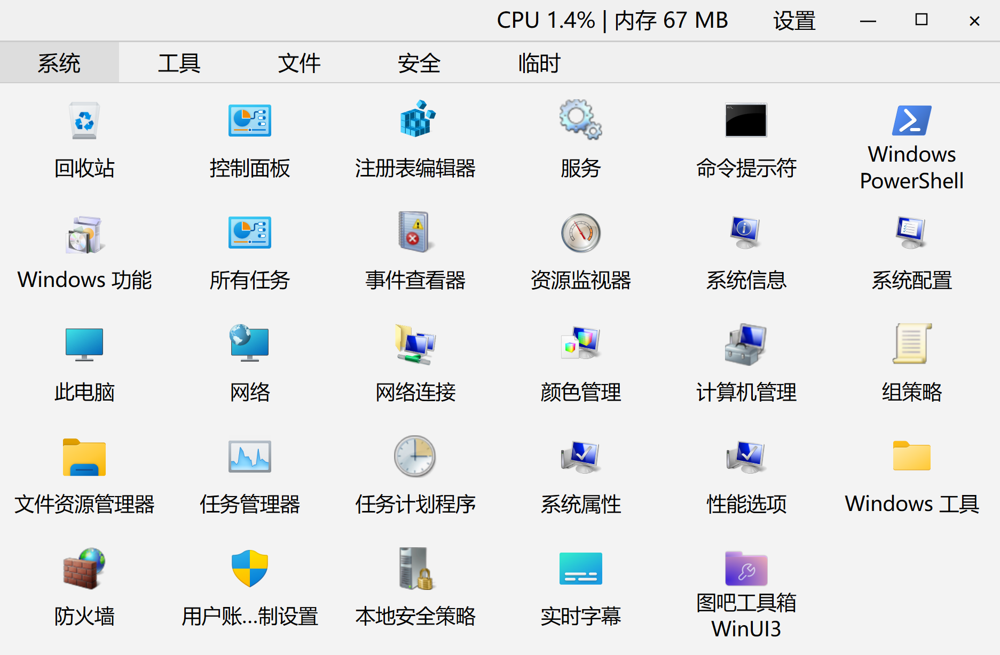
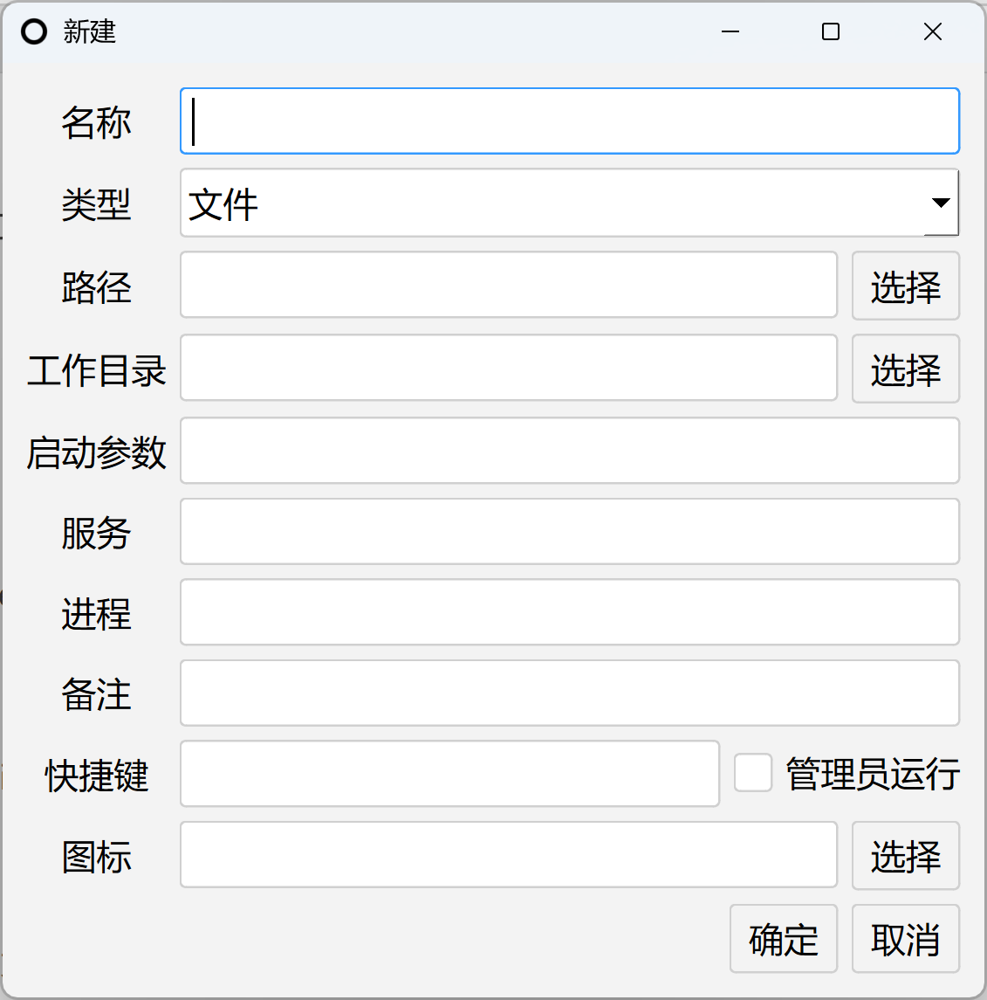
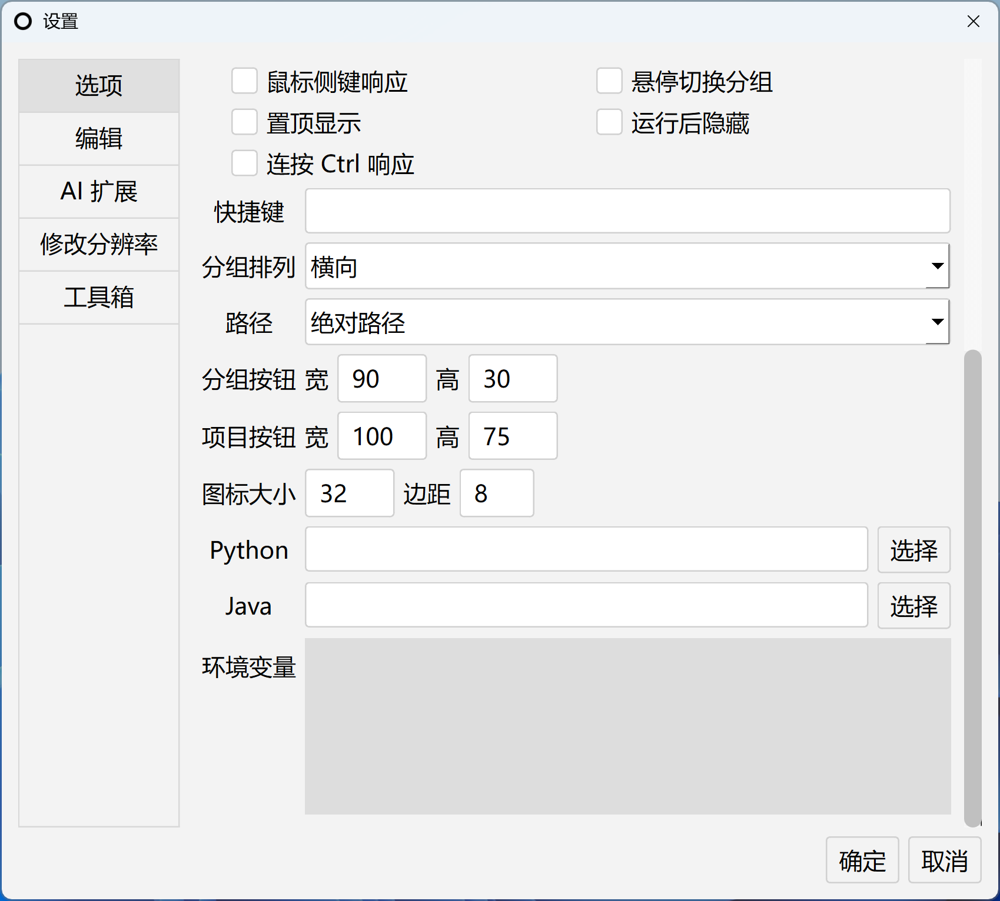
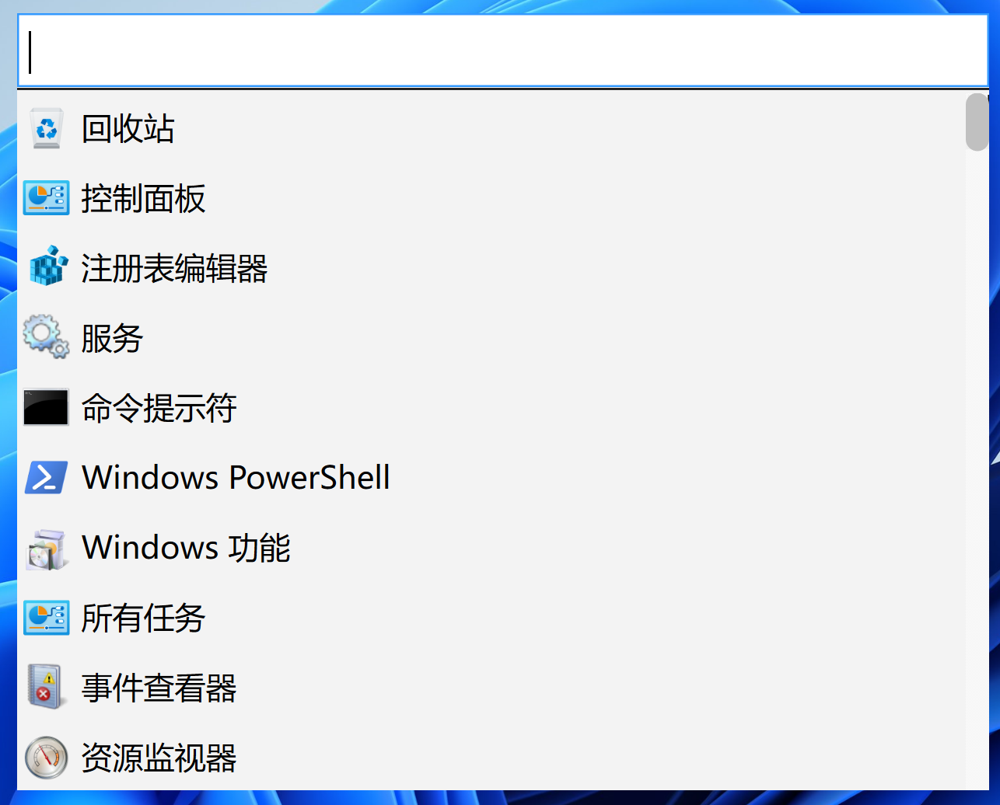
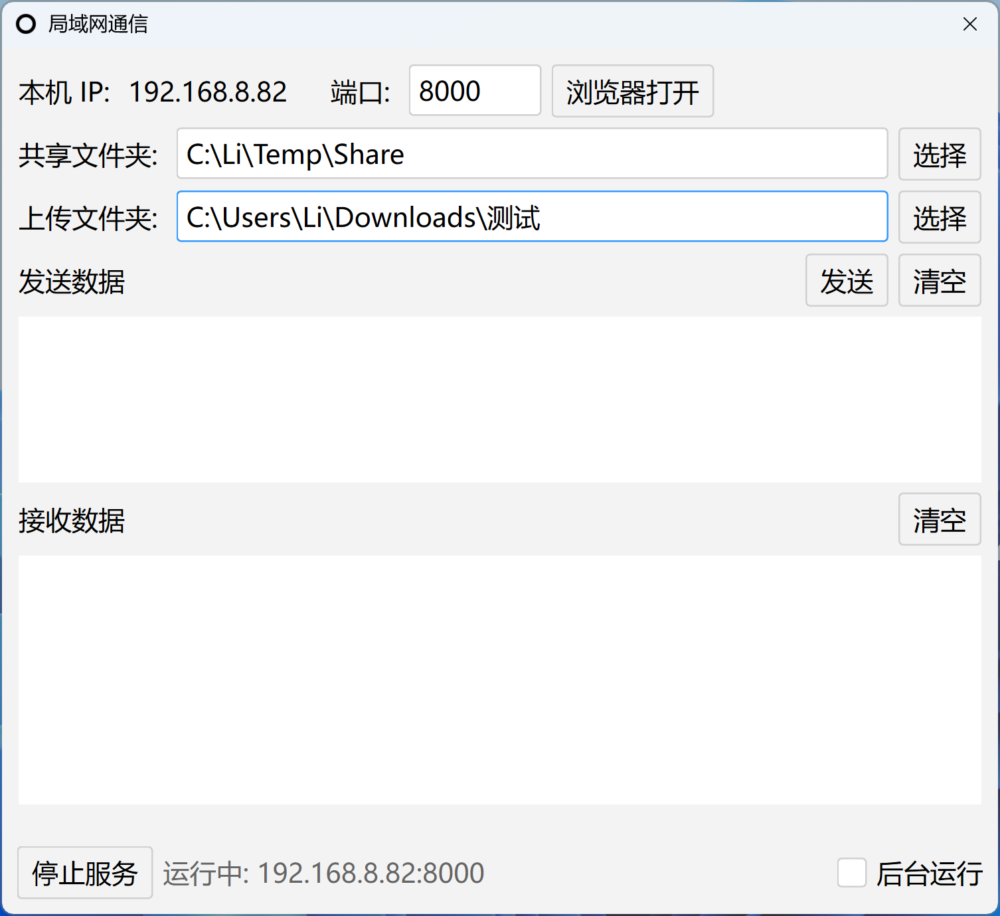

# O

## [简体中文](README.md#简体中文) | [English](README.md#English)

## 简体中文

### 项目简介


O 是一个带了一些奇怪功能的 Windows 快速启动器，适用于桌面杂乱的人群，使用 PySide6 框架，支持插件扩展。O 其实没有任何含义，仅仅是项目需要一个名字，所以在这里出现，因为我是取名废。你可以理解为 `Open`（开放），`Operation`（操作） 或 `Otiose`（无用）或者其他任何含义。

时间是人最宝贵的资源之一，本项目的主旨是提高效率、减少无用操作和重复劳动。

Windows 上的启动器已经有很多轮子了，Quicker、uTools、Maye Lite、Rolan、Lucy、Tiny、Flow Launcher。
它们都是好软件，不过我都有点用不习惯，最后造了一个自己的轮子。如果你认为这个软件很不好用但又需要类似软件，可以去看看。其中 Quicker 的功能应该是最强的，可惜是会员制软件。

提醒您，这是一个比较丑陋的项目，作者大部分时间毫无计划地想到什么加什么，因为这个项目主要是给作者自己使用的。并且这个项目大部分的代码是 AI 写的，不过基本经受了检查，作者正在进行逐步清理与优化。

本项目仍处于开发阶段，功能稳定性仍需验证，正在尝试优化使用体验及功能。感谢您的尝试。

O 当前支持平台为 Windows 8.1+。O 为便携软件，不需要安装，大部分时候不写注册表，卸载只要退出程序后删除文件即可。程序的数据（配置、日志等）存放在 `data/` 目录。

用户自定义插件（.py）和主题文件（.qss），建议放到 data/user 文件夹下，这里是给用户预留的自定义文件夹。虽然在 src 文件夹可以自定义但在更新后就会覆盖掉，但在更新时会删除 data 以外的文件和文件夹，因此不建议这么做。


[笔记](ex/doc.md) 是我的一些笔记，与软件本身关联性很低，只是不想再去开新仓库额外管理，可以看也可以忽略。其内容为软件使用、问题解决、开源项目推荐、杂谈等。

如果你使用 PyQt6，这里有一个[转换脚本](ex/PySide-PyQt.py)，不过测试不充分，不保证可用性。


### 启动器










程序的主要功能为收纳快捷方式，支持打开 exe、打开文件夹、设置 Python 和 Java 路径后运行 .py 和 .jar、打开网址等。

添加启动项的方法为拖拽到界面和右键菜单添加。顶部标题栏双击全屏，边缘处鼠标点击并拖动可调整大小。简易编辑器调整大小则通过最右下角拖动

如果希望通过搜索而不是点击的方式来找到启动项，右键->添加预设项->工具箱->搜索。

另外在打包为 exe 程序后，如果没有配置 Python 路径，将会尝试通过程序自身的 Python 解释器运行 .py 脚本，当然，这不是很稳定。

路径支持环境变量如 %UserProfile%。

图标可以填一个 exe 文件的路径，会获取它的图标。


启动参数（args），支持两个特殊占位符：`{Select}`：运行时先模拟 Ctrl+C 捕获当前选中的文本并替换，此功能需要在设置中勾选运行后隐藏，否则无法获取选中内容。另一个是 `{env: KEY=value}` ，在下方的环境变量中介绍。

管理员运行仅`文件`类型生效。

呼出方式在设置中修改，支持全局快捷键、鼠标侧键（前进/后退键）、连按 Ctrl。


#### 环境变量

在设置->选项->环境变量中，可以填写环境变量，程序启动时会向系统注入这些环境变量。

C:\SDK\MinGW\   将此文件夹加入 Path

ANDROID_HOME=C:\Android\SDK   将其加入环境变量

这是针对所有项目的环境变量

如果要针对单个程序

在启动项参数中加入形如 `{env: CLAUDE_CODE_NO_FLICKER=1}`  ，每个 {env: } 内填入一个环境变量，用空格` `分隔多个 {env: }。仅在该程序运行期间临时设置环境变量，结束后恢复

对于一些程序，可以通过此功能达到修改程序数据目录的效果，如 `{env: UserProfile=C:\data} {env: AppData=C:\data\AppData\Roaming} {env: LocalAppData=C:\data\AppData\Local}`

对 WebView2 程序，可以通过 `{env: WEBVIEW2_USER_DATA_FOLDER=C:\data\WebView\desktop}` 来指定 WebView 缓存目录，不过用处不大，只能让 AppData 文件夹干净一些。

由于 Electron 软件的目录机制，使用此功能可能导致无法启动。对 Electron 和其他基于 Chromium 的软件建议使用形如 `--user-data-dir=C:\data\obsidian` 的启动参数来指定数据目录。


#### 进程/服务管理

此功能仅针对 .exe 程序，需要管理员权限。适用于百度网盘、WPS等软件的流氓进程，还有 VMware 这种关闭后有好几个服务在运行的。

填写格式，使用 " | " 来对各个服务、进程进行分隔，有空格要用 "" 包裹，有服务和进程白名单，免得误操作给系统搞崩溃了。

这里列举一些例子，同时也欢迎各位反馈。

VMware：服务里 VMAuthdService | VMnetDHCP | VMUSBArbService | "VMware NAT Service" ，可能还有一个托盘进程

百度网盘：进程里填写 YunDetectService.exe

如果你需要更加强大的处理流氓软件的功能，可以使用 [Sandboxie](https://github.com/sandboxie-plus/Sandboxie/releases)，可以隔离文件和进程到虚拟环境中。

可以使用资源监视器搜索指定软件有哪些流氓进程，打开方式为 任务管理器->性能->运行新任务右边->资源监视器->句柄搜索


具体原理

在用户启动主进程后，设置一个定时器，十秒检查一次主进程状态。

进程管理：检测到用户结束主进程后，结束其附属进程

服务管理：在启动主进程时，先检查附属服务状态，如果不是手动启用，设置其为手动启用，然后启动附属服务。检测到用户结束主进程后，停止附属服务。


#### 其他

内置的简易编辑器和文件查看器功能不完善，可以不使用。

右键->添加预设项 中可以添加程序自身、系统、插件的一些功能。

更新通过右键->添加预设项的更新来进行，本功能尚未测试所以更新功能可能不稳定。


### 插件

#### 插件规范

插件路径为 plugin/ ，用户自定义插件路径为 data/user/，其内的每个 .py、.pyd 文件都是一个插件


插件系统
PluginBase（基类） — 定义在 src/plugin.py，所有插件必须继承此类

getAction()，控制插件返回的按钮

如果有需要额外导入的 Python 库依赖，在 .py 文件中用 PluginLib 列表标明。


配置保存

插件配置存储在主配置文件 /data/config.json 的 Plugin.plugin_name 下：
  {
    "Plugin": {
      "plugin_name": {
        "enabled": true,
        "……"
      }
    }
  }

插件通过 PluginBase 的 loadConfig() 读取 config["Plugin"] 下自己名字对应的配置，用 saveConfig() 写回，写回时会保留 enabled 字段。

插件管理器通过 initConfig() 读取各插件的 enabled 字段决定是否加载，用 saveConfig() 把启用状态和插件配置一并写回。

Plugin.plugin_name 的 enabled 字段由插件管理器控制，插件请勿直接对整个字典赋值，以免覆盖 enabled 字段。应该使用 update() 或使用一个单独的子字段保存配置。


开发新插件

1. 在 plugin/ 下新建 .py 文件
2. 定义类继承 PluginBase，设置 description 属性
3. 实现 getAction() 返回菜单项


#### 工具箱

搜索：全局搜索启动项，按名称/路径/备注过滤，回车直接运行




快速文本：文本片段选择器，选中后写入剪贴板并模拟 Ctrl+V 粘贴到任意程序

批量重命名：支持查找替换、数字排序、固定前缀、固定后缀四种模式，实时预览

查找重复文件：按 MD5 分组找出重复文件，可移动到回收站。

快速粘贴：取回当前选中的文本，清理开头空行后粘贴进编辑器

自动滑动：模拟鼠标滚轮持续向下滚动，速度可调

自动复制：剪贴板文本变化时自动向指定文件追加写入 data/copy.txt

自动搜索：剪贴板文本变化后自动搜索文件内容，搜索到时右下角弹窗，双击打开并跳转到对应行

自动点击：定时模拟鼠标左键点击，运行中按数字键 1-9 实时调整间隔，Esc 停止

URL 协议注册：把自定义协议（如 `myapp://`）注册到系统，绑定到任意程序，点击链接即可唤起


#### 局域网通信



在电脑上启动一个 HTTP 服务器，局域网内其他设备（尤其是手机）可以直接在浏览器访问 `http://IP:port` 使用。举例： http://192.168.8.2:8000

- 文件浏览与下载：列出共享文件夹，支持中文文件名
- 文件上传：支持网页端拖拽上传，大文件走流式上传
- 文本消息：网页端和对话框可以互相收发文本。
- 网页针对手机访问做了适配。

按理说应该用 qrcode 生成二维码的，然后手机可以直接扫码打开网址，但是考虑到程序体积的增加，暂时没有使用此方案，后续再看是否有必要。


#### OpenList

需要额外学习 OpenList 的使用。

[OpenList](https://github.com/OpenListTeam/OpenList/releases) 是一个开源项目，此插件调用 OpenList 的 API 进行文件同步。


文件排除规则是相对于源目录的，是相对路径，/ 和 \ 效果相同

举例，当前目录是 C:\Code ，想排除 C:\Code\SDK\Python

下面两种写法都可以

\SDK\Python\

/SDK/Python/


打包成 tar 的文件夹，将指定文件夹打包成 tar 再上传，文件夹本身不上传，这个功能是专门针对大量小文件的。


文件树文件夹，将指定文件夹的目录结构打包成 txt 文件后上传，文件夹本身不上传。
目录结构类似 Windows 的 tree 命令。


#### AI 扩展

为什么有 AI 功能呢？因为这个项目之前是我的毕业设计，虽然后来大改了好几次，基本看不出原样了，但还是保留了这部分功能，不过我个人是不喜欢什么都加 AI 的。事实上本项目的 AI 功能也称得上比较难用，只不过调用起来比较方便。

右键 AI：选中文本、文件或文件夹后调用 AI 处理，文件直接作为附件发送，结果在置顶对话框中流式显示，可复制或粘贴回编辑器。请注意，这个对话框是点击底部按钮后自动关闭的。

AI 面板：独立置顶窗口或停靠在编辑器右侧，支持多对话管理、模型下拉选择与刷新、导出对话（Markdown/纯文本）、提示词快捷按钮、消息拖拽图片。

OCR：拖入单张图片或整个文件夹批量识别文字，结果自动保存为 txt 并在编辑器中打开。

支持的服务商：Claude、DeepSeek、Gemini、Ollama（本地）、OpenAI 及 OpenAI 兼容服务（DeepSeek、OpenRouter、New API、阿里云百炼、火山引擎、腾讯混元、硅基流动等）、自定义 API。

负载均衡：可为每个配置档设置优先级和权重，请求自动分配，连续失败自动禁用。


#### 符号链接

此插件用于管理符号链接。支持跨盘符移动，支持环境变量如 %UserProfile%

适用情况
1. C 盘空间紧张，要移动内容到 D 盘。
2. 想把软件数据放在同一个文件夹进行管理。

需要使用管理员权限。使用前建议备份一下文件夹。注意！请不要对 C:\Windows 等系统文件夹使用！！！


简略说明

源路径 C:\Users\User\.ollama，目标路径 D:\Tool\Data\.ollama

目标路径是一个已经存在的文件夹，末尾增加源路径的末尾，这里是 `.ollama`


详细说明

源路径的文件或文件夹 C:\Users\User\.ollama，

目标路径的文件或文件夹 D:\Tool\AppData\.ollama ，是操作完成后形成的路径，运行前，文件夹 D:\Tool\AppData\ 要存在，但内部不能存在 .ollama 同名文件或文件夹

注意要让源路径和目标路径末尾的文件或文件夹名相同。


几个按钮的具体行为如下

运行具体行为

C:\Users\User\.ollama 会被移动到 D:\Tool\AppData  内部，形成 D:\Tool\AppData\.ollama 的路径，然后在 C:\Users\User\.ollama 创建一个指向 D:\Tool\AppData\.ollama 的符号链接，从而达到访问 C:\Users\User\.ollama 实际上是访问 D:\Tool\AppData\.ollama 的效果。

符号链接的原理导致移动文件夹才能达到减小 C 盘或统一管理文件的目的。

在 D:\Tool\AppData 文件夹存在且内部没有 .ollama 文件夹的情况下，大致等效于下方的 cmd 命令。不过增加了校验和回退。

```
move C:\Users\User\.ollama D:\Tool\AppData
mklink /D C:\Users\User\.ollama D:\Tool\AppData\.ollama
```


恢复具体行为，删除源路径的符号链接，然后把目标路径的文件或文件夹移动回去，如果源路径不是符号链接，会提示是否将其删除然后覆盖内容。

测试具体行为，检测所有保存的符号链接路径，源路径是否存在，是符号链接还是文件、文件夹，目标路径是否存在，是符号链接还是文件、文件夹


#### 修改分辨率

在设置页中配置分辨率列表（默认有 1280×720、1920×1080、1920×1200、2560×1440、2560×1600、3200×2000），每行一个，菜单里点一下即可切换。
切换时会先测试显示器是否支持，再临时切换并询问是否保留：选择是则写入注册表永久生效，否则自动恢复原来的分辨率。


### Windows 设置

右键->添加预设项->系统 中有一些 Windows 特定功能

除此之外你可能需要的 Windows 路径

控制面板  C:\Windows\System32\control.exe

注册表编辑器  C:\Windows\regedit.exe

服务  C:\Windows\System32\services.msc

PowerShell C:\Windows\System32\WindowsPowerShell\v1.0\powershell.exe

Windows 功能  C:\Windows\System32\OptionalFeatures.exe

事件查看器  C:\Windows\System32\eventvwr.msc

资源监视器  C:\Windows\System32\perfmon.exe

系统信息  C:\Windows\System32\msinfo32.exe

系统配置  C:\Windows\System32\msconfig.exe

颜色管理  C:\Windows\System32\colorcpl.exe

计算机管理  C:\Windows\System32\compmgmt.msc

组策略  C:\Windows\System32\gpedit.msc

文件资源管理器  C:\Windows\explorer.exe

任务管理器  C:\Windows\System32\Taskmgr.exe

任务计划程序  C:\Windows\System32\taskschd.msc

系统属性  C:\Windows\System32\SystemPropertiesComputerName.exe

性能选项  C:\Windows\System32\SystemPropertiesPerformance.exe

Windows 工具  C:\ProgramData\Microsoft\Windows\Start Menu\Programs\Administrative Tools

防火墙  C:\Windows\System32\WF.msc

用户账户控制设置  C:\Windows\System32\UserAccountControlSettings.exe

本地安全策略  C:\Windows\System32\secpol.msc

实时字幕  C:\Windows\System32\LiveCaptions.exe


### 计划

1. 在不增加新依赖的情况下尽可能扩展功能
2. 清理代码
3. 优化我丑陋的 UI


可能会做的事有
1. 图片质量比较、图片相似度比较


已发现但暂时搁置的问题
1. 未实现鼠标移动到窗口边缘的形状变化，降级为当前方案


### 感谢名单

[OpenList](https://github.com/OpenListTeam/OpenList)


## English

### About

O is a fast launcher with a bunch of strange features, built on the PySide6 framework, with plugin support. O doesn't actually mean anything — it's just that the project needed a name, so it shows up here, because I'm terrible at naming things. You can think of it as `Open`, `Operation`, or `Otiose` (useless), or anything else you like.

There are already plenty of wheels for launchers on Windows: Quicker, uTools, Maye Lite, Rolan, Lucy, Tiny, Flow Launcher. They're all good software, but none of them quite fit how I work, so in the end I built my own wheel. If you find this software hard to use but still need something similar, go check them out. Quicker probably has the most powerful features, but unfortunately it's subscription-based.

Fair warning: this is a pretty ugly project. The author mostly adds whatever comes to mind without any plan, because this project is mainly for personal use. Also, most of the code in this project was written by AI — though it has basically been reviewed — and the author is gradually cleaning it up and optimizing it.

This project is still in development, and its stability has yet to be fully verified. I'm working on polishing the user experience and features. Thank you for trying it out.

O currently supports Windows 8.1+. O is portable software — no installation required, and it mostly doesn't touch the registry. To uninstall, just exit the program and delete the files. Program data (config, logs, etc.) is stored in the `data/` directory.

For your own custom plugins (.py) and themes (.qss), it's recommended to put them in the `data/user` folder — that's the folder reserved for users. Although you can customize things inside the `src` folder, they'd be overwritten after an update, because updates delete everything except `data`, so it's not recommended.

[Notes](ex/doc.md) are some of my notes — barely related to the software itself, I just didn't want to spin up another repo to manage them. You can read them or ignore them. They cover software usage, problem solving, open-source project recommendations, and miscellaneous thoughts.

If you use PyQt6, there's a [conversion script](ex/PySide-PyQt.py) here, though it hasn't been thoroughly tested, so no guarantees.

### Launcher


The program's main function is to collect shortcuts. It supports launching exe files, opening folders, running .py and .jar after configuring the Python and Java paths, opening URLs, etc. Also, once packaged as an exe, if no Python path is configured, it will try to run .py scripts through the program's own Python interpreter — though that's not very stable. Paths support environment variables like `%UserProfile%`. For the icon, you can fill in the path of an exe file and it will extract that icon.

To add launcher items, drag them onto the window, or add them via the right-click menu.
Double-click the title bar to toggle fullscreen; click and drag at the window edges to resize. The simple editor is resized by dragging its bottom-right corner.
If you prefer finding launcher items by searching rather than clicking, go to Right-click -> Add preset items -> Toolbox -> Search.

Launch arguments (args) support two special placeholders: `{Select}`: simulates Ctrl+C at runtime to capture the currently selected text and substitute it in, this feature requires enabling "Hide after running" in the settings; otherwise, the selected content cannot be retrieved. The other is `{env: KEY=value}`, covered in the environment variables section below.

Running as administrator only works for the `File` type.

How you summon it is configured in Settings — global hotkey, mouse side buttons (forward/back), or double-pressing Ctrl.

#### Environment Variables

In Settings -> Options -> Environment Variables, you can fill in environment variables that the program injects into the system at startup.
`C:\SDK\MinGW\`    adds this folder to Path
`ANDROID_HOME=C:\Android\SDK`    adds it as an environment variable
These are environment variables for all projects.

To target a single program, add something like `{env: CLAUDE_CODE_NO_FLICKER=1}` to its launch arguments. Each `{env: }` holds one environment variable, with multiple `{env: }` separated by spaces ` `. The variable is set temporarily only while that program runs and is restored afterwards.

For some programs, this feature can be used to redirect the program's data directory, e.g. `{env: UserProfile=C:\data} {env: AppData=C:\data\AppData\Roaming} {env: LocalAppData=C:\data\AppData\Local}`.

For WebView2 programs, you can use `{env: WEBVIEW2_USER_DATA_FOLDER=C:\data\WebView\desktop}` to specify the WebView cache directory, though it's not very useful — it just keeps the AppData folder a bit cleaner.

Due to how Electron apps handle their directory structure, this feature can prevent them from starting. For Electron and other Chromium-based software, it's recommended to specify the data directory with a launch argument like `--user-data-dir=C:\data\obsidian` instead.

#### Process / Service Management

This feature only applies to .exe programs and requires administrator privileges. It's meant for rogue processes from software like Baidu Netdisk and WPS, and for software like VMware that leaves several services running after you close it.

Fill-in format: use " | " to separate the various services and processes. If there are spaces, wrap them in "" (quotes). There are whitelists for services and processes, so you don't accidentally crash the system.

Here are some examples, and feedback is welcome.
VMware: under services, VMAuthdService | VMnetDHCP | VMUSBArbService | "VMware NAT Service"; there may also be a tray process.
Baidu Netdisk: under processes, fill in YunDetectService.exe.

If you need something more powerful for dealing with rogue software, you can use [Sandboxie](https://github.com/sandboxie-plus/Sandboxie/releases), which isolates files and processes in a virtual environment.

You can use Resource Monitor to search which rogue processes a given software has. Open it via Task Manager -> Performance -> "Run new task" (the arrow on the right) -> Resource Monitor -> Handle search.

How it works: after the user starts the main process, a timer checks the main process status every ten seconds.

Process management: when it detects the user has ended the main process, it ends its attached processes.

Service management: when starting the main process, it first checks the attached services' status; if not set to manual, it sets them to manual, then starts them. When it detects the user has ended the main process, it stops the attached services.

#### Misc

The built-in simple editor and file viewer are incomplete — feel free not to use them.
Right-click -> Add preset items lets you add features of the program itself, the system, and plugins.
Updates go through the "Update" item under Right-click -> Add preset items. This feature hasn't been tested yet, so updates may be unstable.

### Plugins

#### Plugin Spec

Plugins live in `plugin/`; user plugins go in `data/user/`. Every .py and .pyd file inside is a plugin.

The plugin system:
PluginBase (base class) — defined in src/plugin.py; all plugins must inherit from it.

getAction() controls the button the plugin returns.

If you need extra Python library dependencies, declare them in the .py file as a `PluginLib` list.

Config saving:
Plugin config is stored under `Plugin.plugin_name` in the main config file `/data/config.json`:
  {
    "Plugin": {
      "plugin_name": {
        "enabled": true,
        "..."
      }
    }
  }
Plugins read the config corresponding to their own name under config["Plugin"] via PluginBase's loadConfig(), and write back with saveConfig(); the enabled field is preserved on write-back.
The plugin manager reads each plugin's enabled field via initConfig() to decide whether to load it, and uses saveConfig() to write back the enabled state together with the plugin config.
The enabled field of Plugin.plugin_name is controlled by the plugin manager. Plugins should not assign the whole dict directly, to avoid overwriting the enabled field. Use update(), or save config in a separate sub-field.

Developing a new plugin:
1. Create a .py file in `plugin/`
2. Define a class inheriting PluginBase and set the description attribute
3. Implement getAction() to return a menu item

#### Toolbox

Search: global search over launcher items, filtered by name/path/note, press Enter to run directly.
Quick Text: a text-snippet picker; the selected snippet is copied to the clipboard and pasted into any program via a simulated Ctrl+V.
Batch Rename: supports four modes — find & replace, numeric ordering, fixed prefix, fixed suffix — with live preview.
Find Duplicate Files: groups duplicate files by MD5, with an option to move them to the Recycle Bin.
Quick Paste: grabs the currently selected text, strips leading blank lines, and pastes it into the editor.
Auto Scroll: simulates the mouse wheel scrolling down continuously, speed adjustable.
Auto Copy: automatically appends clipboard text changes to `data/copy.txt`.
Auto Search: automatically searches file contents when the clipboard text changes; results pop up in a dialog — double-click to open and jump to the matching line.
Auto Click: periodically simulates a left mouse click; while running, press number keys 1-9 to adjust the interval in real time, Esc to stop.
URL Protocol Registration: registers a custom protocol (e.g. `myapp://`) with the system and binds it to any program — clicking the link summons it.

#### LAN Communication


Starts an HTTP server on the PC; other devices on the LAN (especially phones) can use it directly in a browser at `http://IP:port`. Example: http://192.168.8.2:8000

- File browsing & download: lists shared folders, supports Chinese filenames.
- File upload: supports drag-and-drop upload from the web page; large files stream.
- Text messages: the web page and the dialog can send text back and forth.
- The web page is adapted for phone access.

Strictly speaking, a QR code should be generated with qrcode so a phone can scan and open the URL directly, but considering the increase in program size, this approach isn't used for now — maybe later.


#### OpenList

You'll need to learn OpenList separately.

[OpenList](https://github.com/OpenListTeam/OpenList/releases) is an open-source project; this plugin calls OpenList's API for file sync.


Exclude rules are relative to the source directory, and are relative paths; `/` and `\` work the same.

For example, if the current directory is C:\Code and you want to exclude C:\Code\SDK\Python, either of these works:
\SDK\Python\
/SDK/Python/


Folders packed as tar: the specified folder is packed into a tar archive and uploaded — the folder itself isn't uploaded. This feature is aimed at large numbers of small files.

File tree folders: the directory structure of the specified folder is packed into a txt file and uploaded — the folder itself isn't uploaded. The structure resembles the output of the Windows `tree` command.


#### AI Extension

Why is there an AI feature? Because this project is also my graduation project. Even though it was heavily reworked several times afterwards, this part was kept. Personally, though, I'm not a fan of shoehorning AI into everything. In fact, the AI feature here is arguably pretty hard to use — it's just convenient to call.

Right-click AI: select text, a file, or a folder and call AI to process it. Files are sent directly as attachments, and results stream in an always-on-top dialog that supports copying or pasting back into the editor. Note that this dialog closes automatically after you click a button at the bottom.
AI Panel: a standalone always-on-top window or docked to the right of the editor; supports multi-conversation management, model dropdown with refresh, conversation export (Markdown / plain text), quick-prompt buttons, and dragging images into messages.
OCR: drag in a single image or an entire folder to batch-recognize text; results are auto-saved as txt and opened in the editor.
Supported providers: Claude, DeepSeek, Gemini, Ollama (local), OpenAI and OpenAI-compatible services (DeepSeek, OpenRouter, New API, Alibaba Cloud Bailian, Volcano Engine, Tencent Hunyuan, SiliconFlow, etc.), and custom APIs.
Load balancing: each profile can be given a priority and weight; requests are distributed automatically, and profiles that keep failing are auto-disabled.

#### Symbolic Links

This plugin is for managing symbolic links.

When it's useful:
1. The C drive is running out of space and you want to move content to the D drive.
2. You want to keep a piece of software's data in the same folder for management.

It requires administrator privileges. It's recommended to back up the folder before using it.
Note! Do NOT use it on system folders like C:\Windows!!!

Usage:
In a nutshell:
Source path: C:\Users\User\.ollama
Target path: D:\Tool\Data\.ollama
The target path is an existing folder; append the tail of the source path — here `.ollama` — to its end.

Cross-drive moves and environment variables like %UserProfile% are supported.

In detail:
The source file or folder C:\Users\User\.ollama, and the target file or folder D:\Tool\AppData\.ollama is the path formed after the operation. Before running, the folder D:\Tool\AppData\ must exist, but it must not already contain a file or folder named .ollama. Note that the file/folder names at the tail of the source and target paths must be the same.

The specific behavior of each button:

Run — behavior: C:\Users\User\.ollama is moved into D:\Tool\AppData, forming the path D:\Tool\AppData\.ollama, then a symbolic link is created at C:\Users\User\.ollama pointing to D:\Tool\AppData\.ollama, so that accessing C:\Users\User\.ollama actually accesses D:\Tool\AppData\.ollama. Due to how symbolic links work, moving the folder is the only way to shrink the C drive or centralize files.

When the D:\Tool\AppData folder exists and contains no .ollama folder, this is roughly equivalent to the cmd commands below, but with added validation and rollback.
```
move C:\Users\User\.ollama D:\Tool\AppData
mklink /D C:\Users\User\.ollama D:\Tool\AppData\.ollama
```

Restore — behavior: deletes the symbolic link at the source path and moves the target file or folder back. If the source path is not a symbolic link, it asks whether to delete it and overwrite its contents.

Test — behavior: checks all saved symbolic-link paths — whether the source path exists and whether it's a symlink, file, or folder, and likewise for the target path.


#### Change Resolution

Configure a resolution list on the settings page (defaults: 1280×720, 1920×1080, 1920×1200, 2560×1440, 2560×1600, 3200×2000), one per line; click one in the menu to switch.
On switch, it first tests whether the display supports it, then temporarily switches and asks whether to keep it: choose yes to write it to the registry permanently, otherwise it automatically restores the previous resolution.


### Windows Settings

Right-click -> Add preset items -> System has some Windows-specific features.

Besides that, Windows paths you might need:
Control Panel  C:\Windows\System32\control.exe
Registry Editor  C:\Windows\regedit.exe
Services  C:\Windows\System32\services.msc
PowerShell C:\Windows\System32\WindowsPowerShell\v1.0\powershell.exe
Windows Features  C:\Windows\System32\OptionalFeatures.exe
Event Viewer  C:\Windows\System32\eventvwr.msc
Resource Monitor  C:\Windows\System32\perfmon.exe
System Information  C:\Windows\System32\msinfo32.exe
System Configuration  C:\Windows\System32\msconfig.exe
Color Management  C:\Windows\System32\colorcpl.exe
Computer Management  C:\Windows\System32\compmgmt.msc
Group Policy  C:\Windows\System32\gpedit.msc
File Explorer  C:\Windows\explorer.exe
Task Manager  C:\Windows\System32\Taskmgr.exe
Task Scheduler  C:\Windows\System32\taskschd.msc
System Properties  C:\Windows\System32\SystemPropertiesComputerName.exe
Performance Options  C:\Windows\System32\SystemPropertiesPerformance.exe
Windows Tools  C:\ProgramData\Microsoft\Windows\Start Menu\Programs\Administrative Tools
Firewall  C:\Windows\System32\WF.msc
User Account Control Settings  C:\Windows\System32\UserAccountControlSettings.exe
Local Security Policy  C:\Windows\System32\secpol.msc
Live Captions  C:\Windows\System32\LiveCaptions.exe

### Plan

1. Expand features as much as possible without adding new dependencies
2. Clean up the code
3. Polish my ugly UI

Things that might get done:
1. Image quality comparison, image similarity comparison

Known issues, shelved for now:
1. The cursor shape change when moving to the window edge isn't implemented; degraded to the current approach

### Acknowledgments

[OpenList](https://github.com/OpenListTeam/OpenList)

